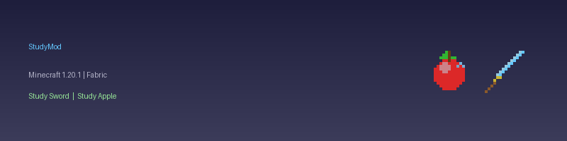

# StudyMod



마인크래프트 1.20.1 Fabric 모드입니다. 강력한 아이템 2개를 추가합니다.

---

## 아이템

### 스터디 검 (Study Sword)
- 다이아몬드 검보다 강한 공격력 (+5 데미지)
- 공격속도: 다이아몬드 검과 동일

**제작법**
```
[ D ]
[ D ]
[ S ]
```
`D` = 다이아몬드, `S` = 막대기

---

### 스터디 사과 (Study Apple)
- 언제든 먹을 수 있음 (배고프지 않아도 OK)
- 허기 10칸 + 포화도 2.0 회복

**제작법**

| 사과 | 다이아몬드 |
|------|-----------|
| 🍎   | 💎        |

(제작대 없이 2x1 인벤토리 조합 가능)

---

## 설치

1. [Fabric Loader](https://fabricmc.net/use/installer/) 설치
2. [Fabric API](https://modrinth.com/mod/fabric-api) 다운로드
3. `studymod-1.0.0.jar`를 `.minecraft/mods` 폴더에 넣기
4. 마인크래프트 실행

## 요구사항

| 항목 | 버전 |
|------|------|
| Minecraft | 1.20.1 |
| Fabric Loader | 0.15.11 이상 |
| Fabric API | 0.92.2+1.20.1 이상 |
| Java | 17 이상 |

## 빌드

```bash
./gradlew build
```

빌드 결과물: `build/libs/studymod-1.0.0.jar`
